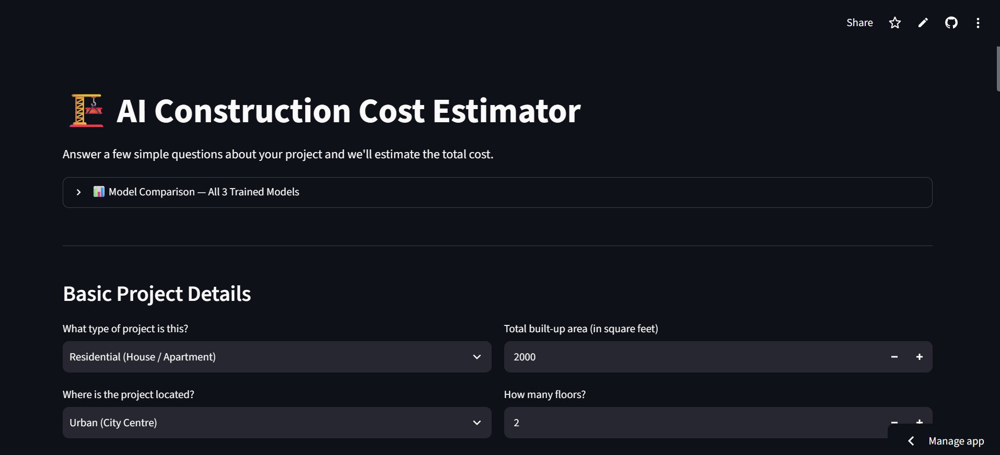

# Construction Cost Estimator 🏗️

### AI-Powered Construction Cost Prediction

Construction Cost Estimator is a machine learning application that predicts **construction costs in PKR** based on project characteristics. The application combines an XGBoost regression model with explainable AI and an LLM-powered recommendation system to provide both cost estimates and actionable insights.

🌐 **[Live Demo]([https://construction-cost-estimator-ai.streamlit.app/]**



## ✨ Features

* 🏗️ **Construction Cost Prediction** — Estimates project costs in PKR using an XGBoost regression model.
* 📊 **Interactive Inputs** — Enter project characteristics directly through the web interface.
* 🔍 **Model Explainability** — Uses SHAP to show which factors influence the predicted cost.
* 🤖 **AI Recommendations** — Uses Groq LLM to generate natural-language cost-reduction suggestions.
* 📈 **Data-Driven Prediction** — Trained on 6,123 real-world construction projects.
* 🌐 **Interactive Web App** — Built and deployed with Streamlit.

## 🛠️ Tech Stack

* **Python**
* **XGBoost**
* **scikit-learn**
* **SHAP**
* **Streamlit**
* **Groq LLM**
* **Pandas**
* **NumPy**
* **Matplotlib**

## 🧠 Machine Learning

The prediction model uses **XGBoost Regression** to estimate construction costs from project-level features.

### Dataset

The model was trained using **6,123 real-world construction projects**, providing a data-driven foundation for cost prediction.

### Explainability

**SHAP (SHapley Additive exPlanations)** is integrated to explain individual predictions and identify the features contributing most to the estimated construction cost.

## 🤖 AI-Powered Recommendations

After generating a prediction, the application uses **Groq LLM** to interpret the project information and provide natural-language recommendations focused on potential cost-saving opportunities.

## 🔄 Workflow

```text
Project Information
        ↓
Data Preprocessing
        ↓
XGBoost Regression Model
        ↓
Predicted Construction Cost
        ↓
SHAP Explainability
        ↓
Groq LLM Recommendations
```

## 📸 Screenshots

### Cost Estimation


### Model Explainability


### AI Recommendations


## 🚀 Run Locally

### Clone the repository

```bash
git clone https://github.com/aamnamz/construction-cost-estimator.git
cd construction-cost-estimator
```

### Install dependencies

```bash
pip install -r requirements.txt
```

### Configure API Key

Create a `.env` file:

```env
GROQ_API_KEY=your_api_key
```

### Run the application

```bash
streamlit run app.py
```

## 📌 Project Status

**Deployed and available as a live Streamlit application.**

## 👩‍💻 Author

**Amna Mumtaz**

[GitHub](https://github.com/aamnamz) · [LinkedIn](https://www.linkedin.com/in/amnaamumtaz/)
